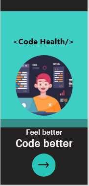
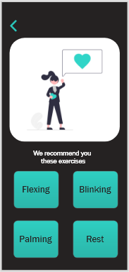
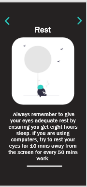

# SheHacks_Team-046
SheHacks'21

Developers face a myriad of physical and mental health challenges in today’s world, whether it’s wrist and back pain, migraines, eye strain, loss of motivation, or trouble focusing. We are building a flutter app which will take a survey and then suggest physical exercises for programmers to stay healthy.

### Screenshots:

  

## Members:
- [Debasmita Das](https://github.com/Debasmita-01)
- [Prerna Gupta](https://github.com/prerna2712)
- [Swarnali Mondal](https://github.com/swarnalii)
- [Vibali Joshi](https://github.com/vibalijoshi)
